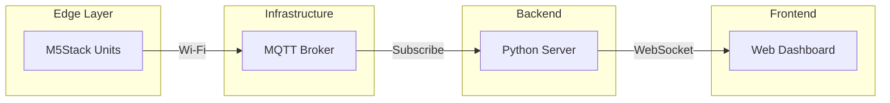

# iot-edge-computing-g8

# 高齢者見守りIoTシステム (Elderly Care IoT System)

## 📌 プロジェクト概要

本プロジェクトは、M5Stack Core2 (ESP32) を活用した、一人暮らしの高齢者を対象とする包括的な見守りシステムです。
複数のIoTデバイスが連携し、転倒検知、環境モニタリング、緊急通報をリアルタイムで行い、Webダッシュボードを通じて介護者や家族が状況を確認できます。

## 🏗 システムアーキテクチャ

システムは **MQTT (Message Queuing Telemetry Transport)** プロトコルを中心に構築されています。



1. **Edge Devices (M5Stack):** センサーデータを収集し、MQTTブローカーに送信。
2. **MQTT Broker:** メッセージの中継地点（ローカルネットワーク内）。
3. **Backend (Python):** メッセージを受信し、データの解析とWebクライアントへのプッシュ通知を行う。
4. **Frontend (HTML/JS):** リアルタイムでデータを可視化し、アラートを表示する。

---

## 🛠 ハードウェア構成 (Devices)

本システムは3つの役割を持つユニットで構成されています。

### 1. 転倒検知ユニット (Fall Detector Unit)

* **役割:** ユーザーの腰に装着し、転倒事故を検知する。
* **機能:**
* 3軸加速度センサー(IMU)による衝撃検知。
* 2.5G以上の衝撃を検知すると即座に「CRITICAL」アラートを送信。
* 誤検知を防ぐためのクールダウンロジック（連続検知防止）。
* バッテリー残量監視。


### 2. 環境モニタリングユニット (Env Monitor Unit)

* **役割:** 居室の快適性と安全性を監視する。
* **センサー:** M5Stack Unit ENV III (SHT30 / QMP6988)
* **機能:**
* 温度・湿度・気圧を5秒ごとに測定。
* 熱中症やヒートショックのリスク管理に活用。


### 3. コミュニケーションユニット (Comm Unit)

* **役割:** ベッドサイドに設置し、緊急通報とメッセージ受信を行う。
* **機能:**
* **緊急ボタン:** ボタンを押すと「HELP NEEDED」アラートを即座に送信。
* **メッセージ受信:** サーバーからのテキストメッセージを画面に表示（視覚的通知）。
* バイブレーションによる触覚フィードバック。


---

## 💻 ソフトウェア機能

### 共通機能 (Shared Library)

* **Heartbeat (生存確認):** 全デバイスが30秒ごとに「生存信号」と「バッテリー残量」を送信。
* **Watchdog (死活監視):** サーバー側で40秒以上信号がないデバイスを自動的に「OFFLINE」と判定。
* **Wi-Fi自動再接続:** 接続が切れた場合、自動的に復帰を試みるロジックを実装。

### ダッシュボード (Web UI)

* **リアルタイム更新:** ページリロードなしでセンサー値やステータスが更新される (WebSocket)。
* **アラートフィード:** 転倒や緊急ボタンの履歴を時系列で表示。
* **バッテリー管理:** 各デバイスの電圧を％表示に変換し、色別（緑・黄・赤）で可視化。
* **音声アラート:** 緊急時にブラウザから警報音を再生（ユーザー操作によるアンロック機能付き）。

---

## 🚀 インストールと実行方法

### 必要要件

* M5Stack Core2 x 2台以上
* M5Unit ENV III
* PC (Linux/NixOS 推奨)
* Mosquitto (MQTT Broker)
* Python 3.x

### 1. MQTTブローカーの起動

```bash
mosquitto -c /etc/mosquitto/mosquitto.conf

```

### 2. サーバーのセットアップ (Python)

```bash
cd server
pip install -r requirements.txt
python app.py
# サーバーは http://0.0.0.0:8000 で起動します

```

### 3. ファームウェアの書き込み (PlatformIO)

各デバイスディレクトリ (`firmware-fall`, `firmware-env`, `firmware-comm`) に移動し、書き込みを行います。
※ `platformio.ini` の `upload_port` を自身の環境に合わせて設定してください。

```bash
cd firmware-fall
pio run --target upload

```

---

## ⚠️ 技術的な注意点

* **バッテリー表示:** 電圧(V)からパーセンテージへの変換は線形近似 (3.2V - 4.2V) を使用しています。
* **音声再生ポリシー:** 最近のブラウザの制限により、初回アクセス時にダッシュボード上の「Enable Audio」ボタンをクリックする必要があります。

---

## 📜 ライセンス

This project is open source.
